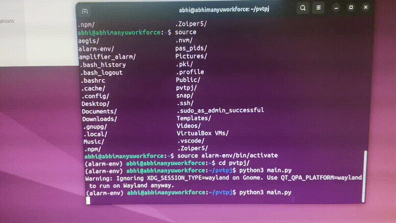

# pdf-pointer
An application that lets you open pdf files and read with the ease of a pointer that moves according to your will in any direction. It also lets your scroll to the next page or previous page as well.

pdf-pointer is an experimental tool that enables **paragraph-level navigation inside PDF documents** using keyboard controls.

Unlike traditional PDF viewers that operate page-by-page or line-by-line, this project focuses on **semantic text blocks**, improving reading flow, accessibility, and document analysis.

---

## Why this exists

PDFs are visually structured but semantically weak.  
This project explores how **text-boundary detection and coordinate mapping** can enable more intelligent document interaction.

---

## Key Features

- Paragraph-level text extraction
- Bounding-box detection for text blocks
- Keyboard-based navigation (Up / Down)
- Visual highlighting of the active paragraph

---

## Demo

<p align="center">
  
</p>


## Architecture Overview

1. Parse PDF text blocks using PyMuPDF
2. Detect paragraph boundaries and bounding boxes
3. Maintain an active paragraph index
4. Render PDF and overlay highlight in the UI

---

## Tech Stack

- Python
- PyMuPDF (fitz)
- PyQt / React (UI prototype)
- PDF.js (browser-based rendering, optional)

---

## Getting Started

```bash
git clone https://github.com/yourusername/pdf-pointer.git
cd pdf-pointer
pip install -r requirements.txt
python src/main.py
